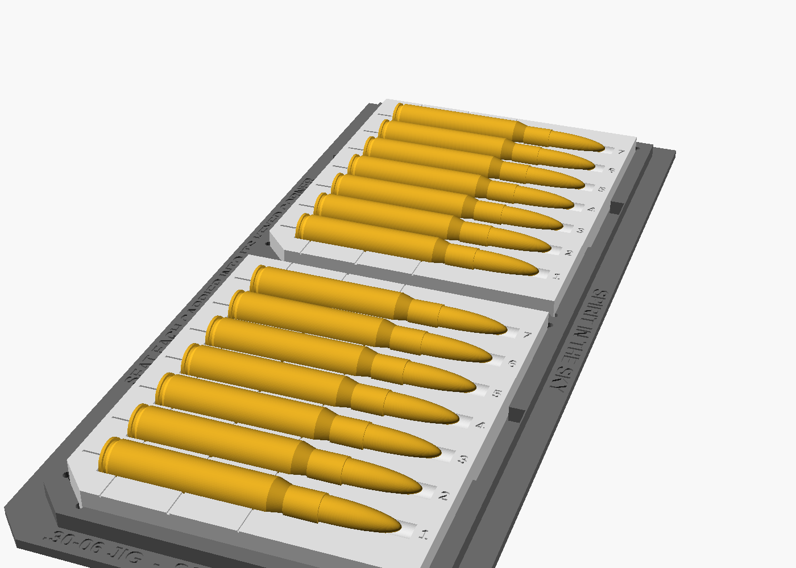
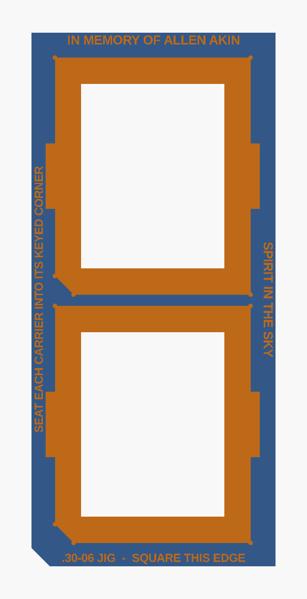

# .30-06 Cartridge Laser-Marking Jig

> ### In memory of Allen Akin
> *September 8, 2026*
>
> This fixture was built to mark the cartridges for his funeral - his name on one
> side, *Spirit in the Sky* on the other. Both are engraved into the base flange,
> so the fixture carries them too. It is published here in the hope that it saves
> someone else a difficult week.
>
> *(If you are reusing this jig, `dedication` and `dedication_edge` at the top of
> `bullet-jig.scad` are yours to change or blank out.)*

A parametric 3D-printable fixture for laser-marking .30-06 Springfield cartridges
consistently, in batches, on two opposing sides.

It replaces the bed-of-rice method: cartridges sit in a cradle that is a true
negative of the SAAMI .30-06 profile, tilted so the engraved surface comes out
**level**, at a known and repeatable height above the laser bed.



---

## How it works

Two parts:

| Part | Role |
|---|---|
| **Base** | Squared and taped to the laser bed **once**, then left alone. Holds the carriers in keyed pockets. |
| **Carrier** | Drops into the base, holds 7 cartridges, lifts out for loading, unloading and flipping. |



Print several carriers. Load one set off the machine while another set is being
marked, then swap them - the keyed pockets mean a carrier can only ever seat one
way, so the laser program never has to be re-registered.

### The level-surface trick

A .30-06 case body is tapered: Ø11.964 at the head, Ø11.204 at the shoulder. Lay
one in a plain cradle and its top surface **drops 0.380 mm** across the marking
area, which walks the work in and out of focus along the length of the text.

The cradle axis is therefore tilted nose-up by exactly the body half-taper:

```
tilt = atan( (5.982 − 5.602) / (49.00 − 3.40) ) = 0.47746°
```

which cancels the taper, because `top(x) = h₀ + x·tan α + r₀ − k·x` is constant
when `tan α = k`. Measured against the supplied mesh, across the whole case body:

```
 cartridge z   true r    apex height
     3.160     5.9821      5.6585
    12.426     5.9062      5.6597
    21.692     5.8302      5.6609
    30.958     5.7542      5.6621
    40.224     5.6782      5.6634
    49.490     5.6022      5.6646

 non-flatness = 0.0061 mm   (0.380 mm if untilted)
```

Six microns - an order of magnitude below anything an FDM printer can hold, and
irrelevant next to the depth of field of a CO₂ lens.

The tilt is also what guarantees the requirement that a cartridge never nests
deeper than half: the cradle axis sits *at* the carrier top face at the head and
rises from there, so every cartridge lifts straight out with no undercut.

### Key dimensions

| | |
|---|---|
| Marking surface above the carrier top face | **5.660 mm** |
| Marking surface above the laser bed | **18.660 mm** |
| Usable marking window | **6 – 46 mm** from the case head (40 mm) |
| Nest pitch | 16.000 mm |
| Cradle clearance | 0.35 mm radial |

The marking window and its centreline are engraved into the carrier as reference
lines. They cross the cradles, so they read as dashes between nests.

---

## Printing

Prusa XL, PLA, **no supports** - the cradle is a surface of revolution opening
upward, so the model is overhang-free by construction.

| File | Size | Notes |
|---|---|---|
| `stl/carrier-7nest.stl` | 104 × 126 × 10 mm | Print 4–8. Two fit side by side on the XL. |
| `stl/base-14up.stl` | 130.8 × 285.6 × 8 mm | 2 carriers, 14 cartridges per load |
| `stl/base-28up.stl` | 241.6 × 285.6 × 8 mm | 4 carriers, 28 per load - still fits both machines |
| `stl/spray-stand-7nest.stl` | 185 × 33 × 39 mm | Clear-coat drying stand - holds 7 nose-down. See [Clear-coating](#clear-coating). |
| `stl/display-plate-17up.stl` | 212.9 × 77.6 × 9 mm | Drawer organizer - one row of 17 casings that others stack on. See [Displaying the casings](#displaying-the-casings). |
| `stl/display-plate-top.stl` | 271.1 × 144.1 × 9 mm | Chest-top display - two rows of 21, multi-color. See [Displaying the casings](#displaying-the-casings). |

* 0.2 mm layers, 3 perimeters, 15–20 % gyroid infill.
* **Brim on the base.** It is a large thin plate and wants to lift at the corners;
  it has to sit dead flat on the bed.
* Print carriers exactly as modelled, cradles facing up.
* PLA is fine - nothing here gets hot. PETG if you would rather it not scorch.

Before committing a batch, work through
**[docs/acceptance-check.md](docs/acceptance-check.md)** on the first carrier and
base off the printer. It is six checks, ordered so the cheap ones gate the
expensive ones.

Both bases fit the Prusa XL's 360 × 360 bed and the xTool P2's 600 × 308 bed. On
the P2 the cartridges run along the 600 mm axis, so the text rasters along the
fast axis and the nests spread across the 308 mm axis.

---

## Setting up on the xTool P2

1. **Square the base** to the gantry using its long straight edge - the flange is
   engraved `SQUARE THIS EDGE`. Tape it down through the flange, outside the walls.
2. **Do not trust nominal coordinates.** A 126 mm PLA part shrinks by a few
   tenths, so the real nest pitch will not be exactly 16.000 mm. Jog the red dot
   to the engraved centreline tick on nest 1 and on nest 7, and derive the pitch
   from the actual printed part. This is the single most important setup step.
3. **Set focus from the marking surface**, nominally 18.660 mm above the bed.
   Verify it on the real thing with calipers - an over-extruded cradle will hold
   the cartridges slightly high.
4. Centre the text on the heavy engraved line, 26 mm ahead of the case head.

---

## Running a batch

1. **Spray the cartridges off the jig**, on a rack, and let them dry. Spraying
   them in the carriers just coats the carriers, which will then mark too.
2. Load carriers, seating every cartridge back against the head stop and every
   carrier into its keyed corner.
3. Run side one on the whole load.
4. Lift the carriers out, roll each cartridge 180° by eye so the first marking
   faces down, reseat.
5. Run side two.
6. Swap in the pre-loaded carriers and unload the finished set while the machine
   is already working on the next.

At 28-up, 150 cartridges is about 6 loads per side.

> On the flip: rolling by eye is good to a few degrees, which is invisible on a
> round cartridge. If you want it exact, engrave both sides in a single program
> with the cartridge rotated between two fixed stops - but for 150 pieces on a
> deadline, by eye is the right call.

---

## Clear-coating

Once both sides are marked, the cartridges get a protective clear topcoat. The
**spray stand** (`spray-stand.scad`, its own model) holds a carrier's worth
**nose-down**, so a single rotating pass covers the whole circumference - both
marked faces at once, no flip-and-redry.

Each round drops nose-first into a bore. The **shoulder** catches on the bore lip
as a self-centring stop - it seats at ~52 mm from the head, just past the 46 mm
marking window, so nothing coating-critical is touched - while the neck stays
guided in the bore below. The head and the full marking window stand up in free
air; the bullet tip hangs through the deck into the open skirt to drain and dry
without touching anything.

Nose-down on purpose: a round balanced head-down on its rim ring is a tall
inverted pendulum and tips at a touch. Hanging by the shoulder with the neck
guided is stable and self-righting.

```bash
openscad -D 'part="stand"' -o stl/spray-stand-7nest.stl spray-stand.scad
```

Prints flat, base down, **no supports** - the funnel and bore open upward. If a
round wobbles, drop `neck_clr`; the skirt height sizes itself so the tip always
clears the bench.

---

## Displaying the casings

For handing the fired casings out as party favours, the **display plate**
(`display-plate.scad`, its own model) is an organizer that carries casings on
their sides. Because a row sits in fixed cradles, more casings **nest in the
valleys between them** and the pile self-stacks into an open pyramid - cannonball
fashion. One model, two footprints via `variant`:

| `variant` | Fits | Holds |
|---|---|---|
| `drawer` (default) | Mini tool-chest **drawer**, 8.5″ wide | one row of **17** |
| `top` | Tool-chest **top**, 10¾″ × 5¾″ | two rows of **21** |

Both are sized to a **[Husky 10 in. Mini Portable Tool Box with 2
Drawers](https://www.homedepot.com/p/Husky-10-in-Army-Green-Metal-Mini-Portable-Tool-Box-with-2-Drawers-690-004-0111/339556529)**
(Home Depot Model # 690-004-0111, Internet # 339556529, Store SKU # 1014987061):
the `drawer` plate to its 8.5″-wide drawers, the `top` plate to its 10¾″ × 5¾″
lid. For a different chest, measure yours and set the footprint at the top of
`display-plate.scad`.

*(The lid closes over an 8 mm inward lip on every edge; the top variant holds the
casings back from it so the lid still shuts. On the 5¾″ (short) axis the two rows
nearly meet in the middle to clear that lip - the depth is the tight dimension,
so keep the plate centred in the well.)*

Two ideas keep the base tidy:

* **Head-to-tail.** A tapered case body laid all one way wedges the stack and
  collides at the rim. Laid head-to-tail, each pair meets fat-body-to-fat-body,
  the pitch is the body diameter, and the valleys run level for the next layer.
  On the drawer the engraved nest numbers zig front/back to cue the lay; the top
  drops the numbers and instead carries **IN MEMORY OF ALLEN AKIN** on the front
  margin and **SPIRIT IN THE SKY** on the back - the way his cartridges carried
  them on opposite sides.
* **A loose fit, on purpose.** These come in and out by hand, so the cradle wraps
  only the lower half (`sink = 0`) and a casing drops **straight in**. Clearance
  is sized to swallow print shrink: a test print came out ~1 mm short on the
  channel, so `axial_clr` leaves the channel comfortably longer than the casing.

```bash
openscad -D 'part="plate"'                     -o stl/display-plate-17up.stl  display-plate.scad
openscad -D 'part="plate"' -D 'variant="top"'  -o stl/display-plate-top.stl   display-plate.scad
```

The top plate is a **multi-color** print on the **Original Prusa XL** - the plate
body in one filament and the two engraved dedications in a contrasting colour, so
*In Memory of Allen Akin* and *Spirit in the Sky* read against the plate. Slice
`stl/display-plate-top.stl` yourself and paint the engraving; it is not shipped as
a `.3mf` because the geometry has been revised and any saved project would be
stale.

If a casing still binds, it is a slop problem, not a geometry one - raise
`round_clr` (radial) or `axial_clr` (length). Set `casing_len` to your measured
brass; the render echoes the nominal channel length so you can check it against
calipers. Prints flat, base down, **no supports** - the cradles open upward.

---

## Parameters

Everything is driven from the top of `bullet-jig.scad`.

```bash
openscad -D 'part="carrier"'              -o stl/carrier-7nest.stl bullet-jig.scad
openscad -D 'part="base"'                 -o stl/base-14up.stl     bullet-jig.scad
openscad -D 'part="base"' -D 'pockets_x=2' -o stl/base-28up.stl    bullet-jig.scad
```

The ones worth touching:

| Parameter | Default | |
|---|---|---|
| `clearance` | `0.35` | Raise to `0.50` for fire-formed (once-fired) cases |
| `nest_count` | `7` | Cartridges per carrier |
| `pockets_x`, `pockets_y` | `1`, `2` | Carrier pockets in the base |
| `nest_pitch` | `16` | Centre-to-centre spacing |
| `dedication` | `"IN MEMORY OF ALLEN AKIN"` | Engraved on the base flange; `""` omits it |
| `dedication_edge` | `"SPIRIT IN THE SKY"` | Engraved on the long flange; `""` omits it |

`part` may be `carrier`, `base`, `both`, `demo` (shows cartridges in place) or
`none`.

### Verification

`verify.scad` intersects the supplied `Cartridge.stl` - the real mesh, not the
transcribed profile - against the cradle at its nominal position. The result must
be empty; anything else means the cradle is cut too tight somewhere.

```bash
openscad -o /dev/null verify.scad     # expect: "Current top level object is empty."
```

---

## Safety

Mark **fired brass or inert dummy rounds only.** Do not put live ammunition under
a laser - primers and propellant do not care that the beam is only meant to reach
the case wall.

---

## Credits

The cartridge profile this fixture is cut against was measured from
`Cartridge.stl`, derived from:

> **[".30-06 Springfield"](https://www.printables.com/model/101907-30-06-springfield)**
> by **[is-serp](https://www.printables.com/@isserp)**, licensed
> **[CC BY 4.0 International](https://creativecommons.org/licenses/by/4.0/)**.

The measured profile was cross-checked against published SAAMI .30-06 Springfield
dimensions (rim Ø12.014, body Ø11.964 → Ø11.204, neck Ø8.634, COAL 84.84) before
being used to cut the cradle.

If you publish a remix of this jig, carry that credit forward - CC BY requires it,
and it costs you one line.

## License

| | |
|---|---|
| This jig (`bullet-jig.scad`, `spray-stand.scad`, `display-plate.scad`, `verify.scad`, `stl/`, docs) | [CC BY 4.0](LICENSE) |
| `Cartridge.stl` | CC BY 4.0, © is-serp - see Credits above |

Use it, sell prints of it, modify it; just keep the attribution. To publish under
different terms, replace `LICENSE` and set the license field on your Printables
listing to match - but note you cannot relicense `Cartridge.stl` itself.
