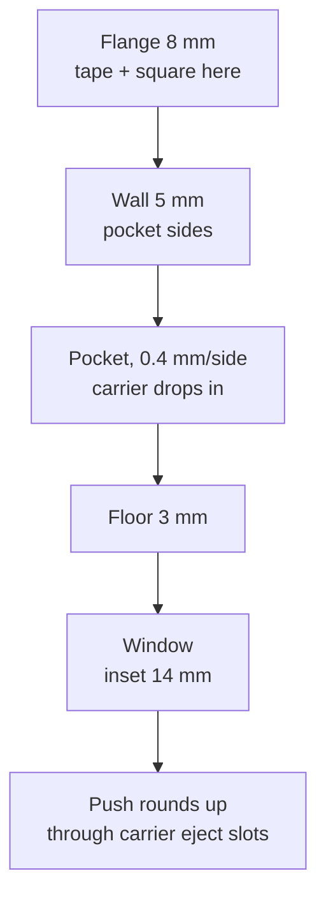

# Base Tray

Squared and taped to the laser bed **once**, then left alone. Everything
downstream is referenced off it, so its flatness is load-bearing.

## Construction

```openscad
pocket_x = carrier_len + 2 * pocket_clr;   // 104.8
pocket_y = carrier_y   + 2 * pocket_clr;   // 126.8
span_x = pockets_x * pocket_x + (pockets_x - 1) * divider;
span_y = pockets_y * pocket_y + (pockets_y - 1) * divider;
base_x = span_x + 2 * base_wall + 2 * flange;
base_y = span_y + 2 * base_wall + 2 * flange;
base_h = base_floor + pocket_depth;        // 3 + 5 = 8
```

A 3 mm floor with 5 mm walls standing 5 mm proud, plus an 8 mm flat flange all
round for taping and squaring.



## Features

- **Pockets**, one per carrier, `pocket_clr = 0.4` per side, `pocket_depth = 5`.
  The carrier is 10 mm thick, so 5 mm stands proud to grip.
- **Key corner** - 45 deg chamfer, `key_chamfer = 10`, on each pocket *and* on
  the overall outline. Breaks every symmetry, so a carrier seats one way only.
- **Corner relief** - r = 1.2 cylinders at each pocket vertex so a slightly
  bulged carrier corner cannot wedge.
- **Floor windows**, inset 14 mm. Save print time and let you push cartridges up
  from underneath through the carrier's eject slots.
- **Finger notches**, 35 mm wide in the end walls, for lifting a loaded carrier.

## Flange engraving

All four flanges are used. Engraved, never raised - raised lettering would stop
the base taping down flat.

| Flange | Text | Source |
|---|---|---|
| bottom (X) | `.30-06 JIG  -  SQUARE THIS EDGE` | fixed |
| left (Y) | `SEAT EACH CARRIER INTO ITS KEYED CORNER` | fixed |
| top (X) | `IN MEMORY OF ALLEN AKIN` | `dedication` |
| right (Y) | `SPIRIT IN THE SKY` | `dedication_edge` |

The dedication is parameterised so anyone reusing the jig can change or blank it
(`""` omits). See [../publishing/licensing.md](../publishing/licensing.md).

## Invariants

- **The base must sit dead flat.** It is a large thin plate; print with a brim.
  If a corner rocks, every height measurement below it is meaningless.
- Flange text must fit inside `base_x`. At `size = 4.5`-`5`, a ~45 character
  string overflows the 130.8 mm 14-up base. Check a top-down render after
  editing any flange string.
- Engrave, never emboss, on the flange.

## Related

- [carrier.md](carrier.md)
- [registration.md](registration.md)
