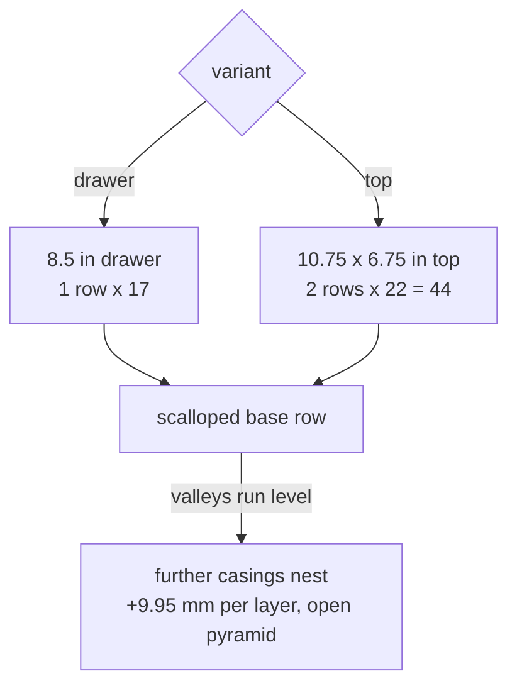

# Display plate

A loose organizer, not a pipeline fixture and not a precision cradle. Fired empty
**casings** (no bullet, ~63 mm to the mouth) are dropped on their sides into a
scalloped plate. Each cradle holds one casing; a row seats a base row, and
further casings nest in the valleys between them so the pile self-stacks into an
**open pyramid** (`layer_rise = sqrt(3) * r_centre` ~ 9.95 mm per layer). Source
is `display-plate.scad` at the repo root; one model, two footprints via `variant`.

These are **party favours**: the aim is tidy organisation, so every casing must
drop in and lift out freely - the opposite instinct from the jig. It shares only
the cartridge profile (the [CART](../geometry/cartridge-profile.md) table,
truncated at the case mouth).

## Two variants (`variant`)

| `variant` | Footprint | Rows x count | STL |
|---|---|---|---|
| `drawer` | 8.5" drawer -> `drawer_w - 2*fit_clr` wide, depth snug to one row | 1 x 17 | `stl/display-plate-17up.stl` |
| `top` | 10.75 x 6.75" chest top, minus `pullback` per edge | 2 x 22 | `stl/display-plate-top-2x22.stl` |

Both footprints are sized to a **Husky 10 in. Mini Portable Tool Box with 2
Drawers** (Home Depot Model # 690-004-0111, Internet # 339556529, Store SKU #
1014987061): the drawer plate to its 8.5" drawers, the top plate to its
10.75 x 6.75" lid.

Every cradle dimension is identical between them; they differ only in outline,
row count, and one packing choice: the drawer uses `stack_gap = 0.60` for finger
room, the top uses `0.25` to make the row count. `drawer` is the default so a bare
render reproduces the shipped drawer plate.

### Why 22 per row on the top, not 23

The alternating head-to-tail pitch is `contact_d = 2 * r_centre` ~ 11.49 mm (the
casings' fat-body cheeks touching). Across a 10.75" top pulled back a few mm, that
packs a robust **22** per row. 23 only fits with the casings dead-touching
(`stack_gap` 0), ~1.5 mm walls and ~2 mm pullback - a 0.18 mm margin that print
swell eats. Decision (owner): 22 per row; 23 sits bare on the top without a plate.

## Loose by design - the slop knobs

The first cut gripped too hard to accept a casing without angling it in. Fixed:

- **`sink = 0`.** The cradle wraps only the **lower half** of the casing, so the
  opening at the surface is the full casing diameter and it drops **straight
  down**. Any positive `sink` grips past the equator (retention, but you must snap
  it in) - keep 0 for party favours.
- **Clearance sized to swallow print shrink.** `round_clr = 0.50` radial;
  `axial_clr = 2.00` extends the channel to **65.55 mm** so it clears the measured
  **63.25 mm** casing by 2.3 mm. A test print came out ~1 mm short of nominal on
  channel length (~1.2 % shrink), so the real margin is ~1.3 mm. Raise
  `round_clr` / `axial_clr` if a printer runs tighter; an assert guards
  `channel_len >= casing_len + 0.5`. The `echo` reports the nominal length for a
  caliper check.

## What keeps a row uniform

**Alternating head-to-tail** cancels the body taper (r 5.982 -> 5.602): each pair
meets fat-body-to-fat-body, the pitch is the body diameter, and the valleys run
level. Packs tighter than one-way (which collides at the rim, O12.014). An assert
guards `pitch >= contact_d`.

**A symmetric negative.** Each cradle is the casing profile of revolution grown by
`round_clr`, end caps pushed out by `axial_clr/2`, laid along Y and unioned with
its mirror (`cradle_cut(cy)`), so a casing seats level whichever way it points.

## Layout

- `count` is **maximised** across the width, then centred (`nest_cx`).
- Rows are spread evenly front-to-back, each occupying `channel_len` of depth
  (`row_cy(j)`, `row_pitch`); an assert stops the rows from overlapping.
- `plate_th = sink + (rim_r + round_clr) + floor` ~ 9.0 mm (thin, since sink 0).

## Markings (`markings` -> `drawer_markings` / `top_markings`)

- **Drawer**: casing numbers in the flat band beyond each casing's head end,
  alternating so they zig and cue the head-to-tail lay; `title` on the front
  face, `dedication` on the back.
- **Top**: a memorial display - **no numbers**. Both `dedication` and
  `dedication_edge` ("IN MEMORY OF ALLEN AKIN" / "SPIRIT IN THE SKY", the same
  pair the funeral cartridges carried on opposite sides) are engraved stacked
  down the centre, in the flat band between the two rows, reading looking down at
  the piece.

## Print

Flat, base down, **no supports** - the cradles open upward. The `demo` part shows
each row's base plus one nested layer.

A ready-to-print slicer project ships for the top variant:
`stl/display-plate-top-2x22.3mf`, a PrusaSlicer project for the **Original Prusa
XL** (multi-tool, 0.4 mm nozzle), sliced **multi-colour** so the centre
dedication prints in a contrasting filament against the plate body. It carries
the same `variant="top"` mesh; the `.stl` beside it is for any other printer.

## Related

- [../geometry/cartridge-profile.md](../geometry/cartridge-profile.md) - the
  `CART` profile this mirrors (truncated at the mouth) and the uniform-offset
  doctrine (here relaxed for a loose fit)
- [spray-stand.md](spray-stand.md) - the other stand-alone companion `.scad`
