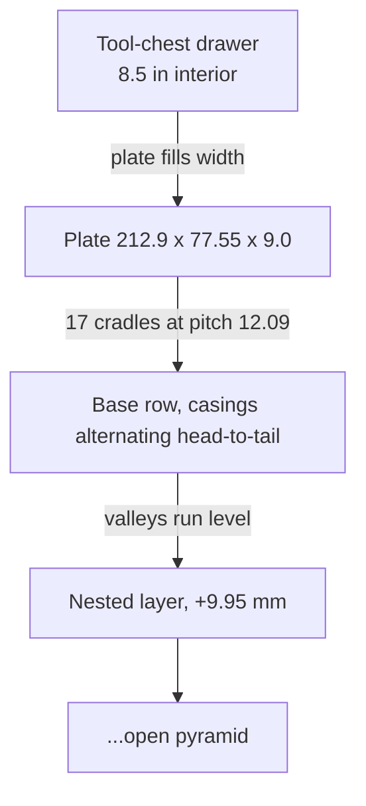

# Display plate

A loose organizer, not a pipeline fixture and not a precision cradle. Fired empty
**casings** (no bullet, ~63 mm to the mouth) are dropped on their sides into a
scalloped plate that sits in a mini tool-chest drawer (8.5 in / 215.9 mm interior
width). Source is `display-plate.scad` at the repo root; production STL is
`stl/display-plate-17up.stl`. It shares only the cartridge profile (the
[CART](../geometry/cartridge-profile.md) table, truncated at the case mouth).

These are **party favours**: the aim is tidy organisation, so every casing must
drop in and lift out freely. The fit is deliberately loose - the opposite
instinct from the jig.

## What it does

The plate carries a single bottom **row** of casings at a uniform pitch. Because
that row sits in fixed cradles, further casings nest in the valleys between them
and the pile self-stacks into an **open pyramid** (`layer_rise = sqrt(3) *
r_centre` ~ 9.95 mm per layer). No lids, no walls, no retention: base row only,
gravity does the rest.

## Loose by design - the slop knobs

The first cut was a tight true-negative and would not accept a casing without
angling it in. Two things caused it, both now dialled for slop:

- **`sink = 0`.** The cradle wraps only the **lower half** of the casing, so the
  opening at the surface is the full casing diameter and it drops **straight
  down**. Any positive `sink` grips past the equator (more retention, but you
  must snap the casing in) - keep it 0 for party favours.
- **Clearance sized to swallow print shrink.** `round_clr = 0.50` radial;
  `axial_clr = 2.00` extends the channel to **65.55 mm** nominal so it clears the
  measured **63.25 mm** casing by 2.3 mm. A test print came out ~1 mm short of
  nominal on channel length (~1.2 % shrink on that printer), so the real margin
  is ~1.3 mm. If a printer runs tighter, raise `round_clr` / `axial_clr`; an
  assert guards `channel_len >= casing_len + 0.5`.

The nominal channel length is reported by an `echo` so it can be checked against
calipers.

## What keeps the base uniform

**Alternating head-to-tail.** A .30-06 case body is tapered (r 5.982 -> 5.602).
Laid head-to-tail each adjacent pair meets fat-body-to-fat-body, whose radii sum
to `contact_d = 2 * r_centre` ~ 11.49 mm - the minimum pitch (an assert guards
`pitch >= contact_d`); working pitch is `contact_d + stack_gap`. This packs
tighter than one-way (which collides at the rim, O12.014) and the valleys run
level.

**A symmetric negative.** Each cradle is the casing profile of revolution grown
by `round_clr`, its end caps pushed out by `axial_clr/2`, laid along Y and
**unioned with its mirror** (`cradle_cut`), so a casing seats level whichever way
it points - supported along its head half, thin neck half in relief.

## Contract (all derived in the `.scad`)

- `count` is **maximised** from the drawer width, then centred. At defaults, **17**.
- `plate_w = drawer_w - 2*fit_clr` - the plate fills the drawer so it locates.
- `plate_th = sink + (rim_r + round_clr) + floor` ~ 9.0 mm (thin, since sink 0).
- `channel_len = profile_len + axial_clr`; `plate_depth = channel_len + 2*end_margin`.
- Four asserts: a cradle fits the width, pitch is not tighter than the casings
  pack, the outer cradle clears the side wall, and the channel is comfortably
  longer than the casing.

## Markings

`number_nests` engraves each casing number at the end where that casing's **head**
goes - alternating front/back so the numbers zig down the row and laying them
head-to-tail needs no thought. `title` on the front face, `dedication` on the
back; both parametric, "" to omit.

## Print

Prints flat, base down, **no supports** - the cradles open upward. The `demo`
part shows the base row plus one nested layer.

## Related

- [../geometry/cartridge-profile.md](../geometry/cartridge-profile.md) - the
  `CART` profile this mirrors (truncated at the mouth) and the uniform-offset
  doctrine (here relaxed for a loose fit)
- [spray-stand.md](spray-stand.md) - the other stand-alone companion `.scad`
