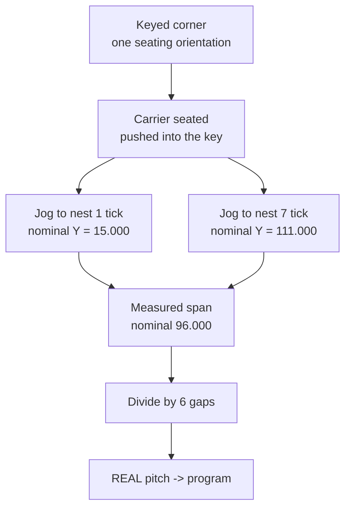

# Registration and Fiducials

How the laser finds the work, and the one measurement the whole setup depends on.

## The doctrine

> **Never program nominal coordinates. Measure the printed part.**

A 126 mm PLA carrier shrinks by a few tenths, so its real nest pitch is not
16.000 mm. Worse, the shrinkage is in the *carrier itself*, so no amount of
precision in the base can correct it. The fix is to make alignment empirical:
engraved fiducials on the carrier, which the operator jogs the red dot to.

## The numbers

| | |
|---|---|
| nest 1 centreline tick | Y = 15.000 mm from the carrier edge |
| nest 7 centreline tick | Y = 111.000 mm |
| span | 96.000 mm across **6** gaps |
| window centre (heavy line) | X = 36 mm from the carrier head-end face |

Derived from `nest_y(i) = side_margin + nest_pitch/2 + i*nest_pitch`, so
`nest_y(0) = 15` and `nest_y(6) = 111`.

## The off-by-one

**Divide the span by 6, not 7.** Seven nests, six gaps. Dividing by the nest
count instead of the gap count yields 13.71 mm and puts the program 2.67 mm out
per nest - a miss, not a rounding error, and one that survives a casual check
because the wrong answer still looks plausibly like "about 16".

## Registration chain

- **Rotation and translation** come from the keyed pocket. Always seat a carrier
  *into* its key corner; the pocket has 0.4 mm/side of clearance, so consistency
  comes from always pushing the same way, not from the fit being tight.
- **Y (across nests)** is the critical direction: error here walks the text off
  the apex crown. It is absorbed by measuring the tick span.
- **X (along the cartridge)** is tolerant; error just shifts text along the case.
- **Z** is `18.660 mm` above the bed, verified with calipers, not assumed.

## Flip registration

The 180 degree flip for side two is done **by eye** - roll the round until the
first marking faces down. Deliberate: rolling is accurate to a few degrees, which
is invisible on a round cartridge, and any positive indexing scheme adds a part
to handle 300 times. The cradle lets the round spin freely about its own axis,
which is what makes this work.

## Related

- [carrier.md](carrier.md) - where the fiducials live
- [base-tray.md](base-tray.md) - the keyed pockets
- [../process/laser-setup-and-batch.md](../process/laser-setup-and-batch.md)
