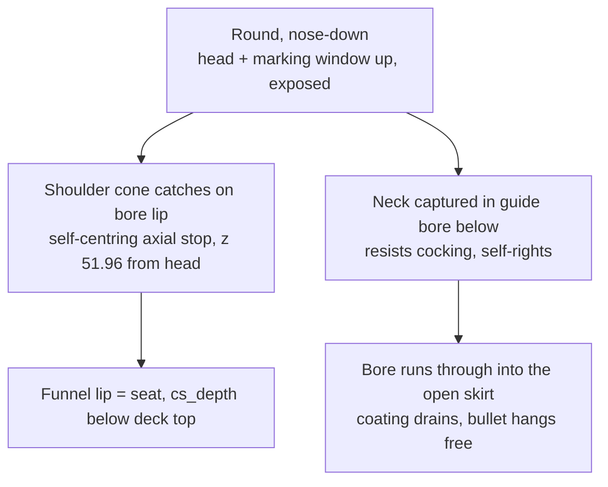

# Spray stand

A companion fixture, separate from the marking jig. After a batch is
laser-marked, the rounds are stood **nose-down** in the spray stand and given a
protective clear coat (a rattle-can topcoat over the CerMark marks). Source is
`spray-stand.scad` at the repo root; production STL is
`stl/spray-stand-7nest.stl`. It shares nothing with the jig but the cartridge
profile it seats against.

## Why nose-down, vertical

A loaded round is a closed cartridge (bullet seated) - it can only be held
externally. Standing it vertical means one **rotating pass coats the whole
circumference**, so both opposing marked faces are covered without a
flip-and-redry cycle a horizontal cradle would force. The
[marking window](../geometry/cartridge-profile.md) (6-46 mm from the head)
stands in free air well above the deck, fully exposed. This part does **not**
use the jig's [levelling tilt](../geometry/levelling-tilt.md) - a drying round
only has to stand still, not present a level surface.

**Nose-down, not nose-up.** A round balanced head-down on its rim ring is a tall
inverted pendulum (COM ~40 mm up over a ~12 mm base) and tips at a touch - the
first nose-up cone-seat attempt failed exactly here. Dropped nose-first into a
bore instead, the slender bullet and neck lead in and the round hangs by its
shoulder, guided along the neck, which is stable and self-righting.

## The shoulder seat

The round drops nose-first into a lead-in funnel over a straight guide bore.

Contract, all derived in the `.scad` from the CART shoulder/neck dimensions:
- Guide bore radius `bore_r = neck_r(4.317) + neck_clr(0.4)` = 4.717
  (O9.43). The neck (O8.634) drops through; the shoulder (widening past it)
  cannot, so it seats.
- The shoulder catches where its cone reaches `bore_r`: **z 51.96 mm from the
  head**. Two asserts guard the design: `bore_r < shoulder top r` (so it seats
  at all) and `seat_zfh > window_to(46)` (so the seat never shadows the marking
  window). If you widen `neck_clr` a lot, re-check the second assert.
- Seat is a ring on the bore lip (cone-on-edge): minimal contact, on the
  unmarked shoulder just past the window, self-centring.
- The bore runs straight through the deck into the open skirt cavity, so coating
  drains out and the bullet tip hangs free.
- Anti-tip: the neck is guided over ~11 mm of bore below the seat at 0.4 mm
  clearance -> the round can only cock ~2 degrees, and gravity re-seats it. This
  is the whole reason nose-down is stable where nose-up was not.

## Structure and print

- Single row of `nest_count = 7` seats at `nest_pitch = 26` mm.
- Deck `185 x 33 x 18`; the bore runs through it. Lifted on a skirt whose height
  is **computed** (`skirt_h`) so the bullet tip (hanging ~17.9 mm below the deck
  bottom) clears the bench by `tip_clr = 3` mm. Overall height ~38.9 mm.
- Skirt corners solid for rigidity; long sides windowed for drainage, airflow
  and finger access. Bullet tips hang in the open windowed cavity.
- Prints flat, base down, **no supports**: the funnel and bore are open upward.
- Seat numbers 1-7 on the deck front match the [carrier](carrier.md) nest
  numbers; `title` on the skirt face and `dedication` on the deck are parametric.

## Related

- [carrier.md](carrier.md) - where the rounds come from; nests numbered to match
- [../geometry/cartridge-profile.md](../geometry/cartridge-profile.md) - the
  shoulder, neck and marking-window dimensions this seats against
- [../process/summary.md](../process/summary.md) - marking spray vs. this clear
  coat are different coatings at different steps
