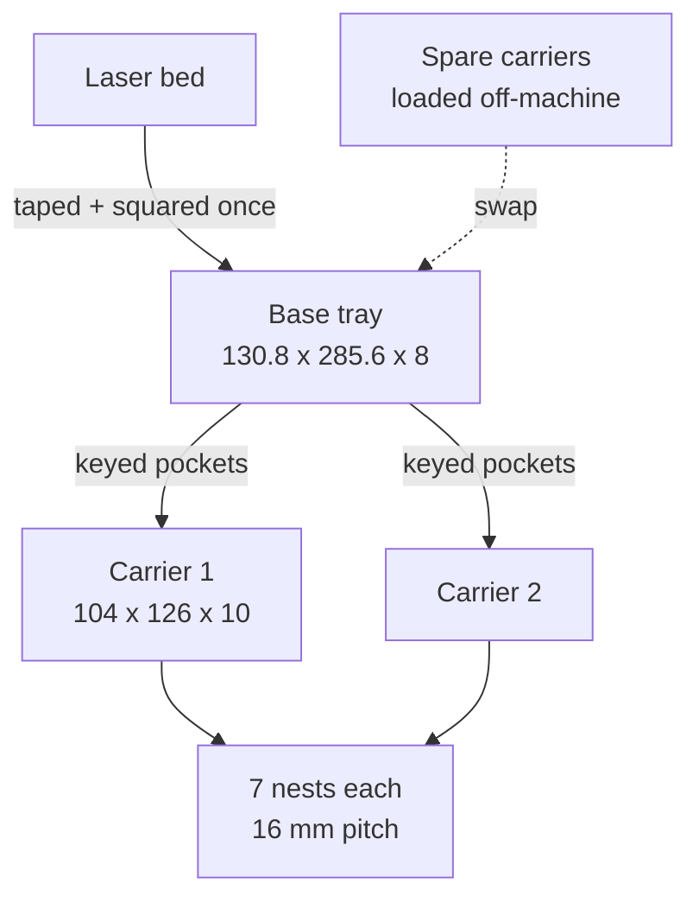

# Fixture

The two physical parts and how they relate.

The base never moves once taped. Carriers are consumable fixturing: print
several, load one set while another is under the laser, swap them. A separate
**spray stand** holds a carrier's worth of rounds nose-down for clear-coating
after marking; it is downstream of the base/carrier, not part of the assembly.

## Files

- [carrier.md](carrier.md) - the removable nest block
- [base-tray.md](base-tray.md) - the taped-down tray
- [registration.md](registration.md) - keying, fiducials, and why nominal
  coordinates must not be trusted
- [spray-stand.md](spray-stand.md) - nose-down shoulder-seat stand for clear-coating
- [display-plate.md](display-plate.md) - scalloped base for stacking finished
  empty cases in a tool-chest drawer

## Part sizes

| Part | Size | Config |
|---|---|---|
| `stl/carrier-7nest.stl` | 104 x 126 x 10 | `nest_count = 7` |
| `stl/base-14up.stl` | 130.8 x 285.6 x 8 | `pockets_x=1, pockets_y=2` |
| `stl/base-28up.stl` | 241.6 x 285.6 x 8 | `pockets_x=2, pockets_y=2` |
| `stl/spray-stand-7nest.stl` | 185 x 33 x 39 | `nest_count = 7` (own `.scad`) |
| `stl/display-plate-17up.stl` | 212.9 x 77.6 x 9.0 | 8.5" drawer -> 17 up, loose fit (own `.scad`) |

## Related

- [../geometry/summary.md](../geometry/summary.md) - what shapes the nests
- [../process/printing-and-machines.md](../process/printing-and-machines.md)
