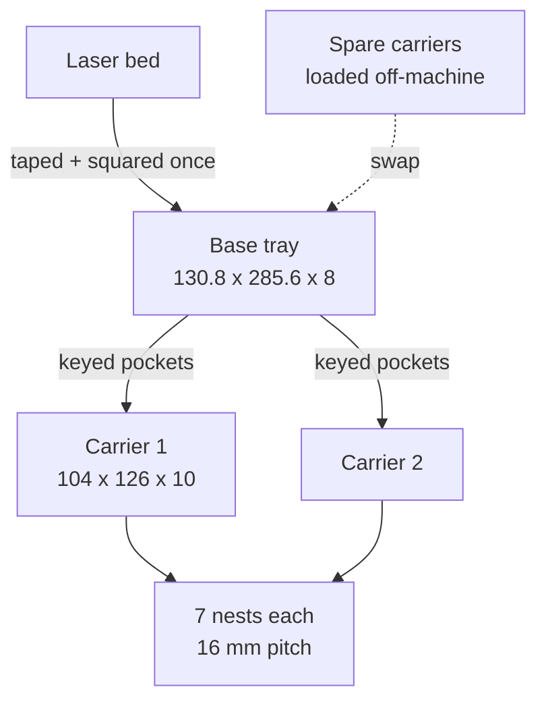

# Fixture

The two physical parts and how they relate.

The base never moves once taped. Carriers are consumable fixturing: print
several, load one set while another is under the laser, swap them.

## Files

- [carrier.md](carrier.md) - the removable nest block
- [base-tray.md](base-tray.md) - the taped-down tray
- [registration.md](registration.md) - keying, fiducials, and why nominal
  coordinates must not be trusted

## Part sizes

| Part | Size | Config |
|---|---|---|
| `stl/carrier-7nest.stl` | 104 x 126 x 10 | `nest_count = 7` |
| `stl/base-14up.stl` | 130.8 x 285.6 x 8 | `pockets_x=1, pockets_y=2` |
| `stl/base-28up.stl` | 241.6 x 285.6 x 8 | `pockets_x=2, pockets_y=2` |

## Related

- [../geometry/summary.md](../geometry/summary.md) - what shapes the nests
- [../process/printing-and-machines.md](../process/printing-and-machines.md)
