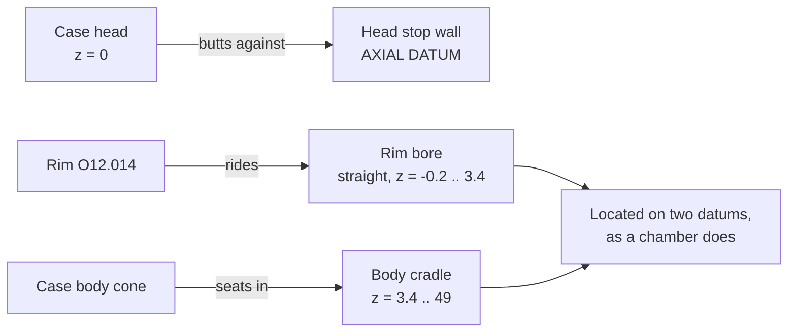

# Cartridge Profile

The cradle is cut as a true negative of a measured .30-06 profile, held in the
`CART` table in `bullet-jig.scad`.

## The table

Columns are `[ axial position from case head, radius, extra local relief ]`.
All values mm. The profile was measured off `Cartridge.stl` and cross-checked
against published SAAMI .30-06 dimensions (rim O12.014, body O11.964 -> O11.204,
neck O8.634, COAL 84.84).

```openscad
CART = [
  //  z       r       relief
  [ -0.20,  6.007,  0.00 ],   // head face, 0.2 mm axial clearance
  [  3.40,  6.007,  0.00 ],   // straight rim bore (extractor groove relieved)
  [  3.40,  5.982,  0.00 ],   // case body, head end
  [ 49.00,  5.602,  0.00 ],   // case body, shoulder end
  [ 53.30,  4.317,  0.30 ],   // shoulder / neck junction
  [ 63.35,  4.317,  0.30 ],   // case mouth
  [ 63.35,  3.925,  0.50 ],   // bullet bearing surface
  // ... ogive points to [ 84.84, 0.300, 0.50 ]
];
```

The cavity is a solid of revolution built from the table with clearance added
radially:

```openscad
module cradle_solid() {
  pts = concat(
    [ [ 0, CART[0][0] ] ],
    [ for (p = CART) [ p[1] + clearance + p[2], p[0] ] ],
    [ [ 0, CART[len(CART) - 1][0] ] ]
  );
  rotate_extrude($fn = nest_fn) polygon(pts);
}
```

## Datum scheme



The cartridge is located by the **rim bore and the body cone only**. Everything
past the shoulder carries extra relief and is not a locating surface.

## Deliberate departures from the real shape

These are design decisions, not omissions. Do not "fix" them:

- **The extractor groove is not reproduced.** The rim rides a plain straight bore
  from z = -0.20 to 3.40 and the groove is left in free air. Reproducing a
  0.8 mm wide groove invites a printed bump inside it, which would rock the
  cartridge and destroy the levelness the whole design is built on.
- **Extra relief past the shoulder** (0.30 mm at the neck, 0.50 mm on the
  bullet). This lets a fire-formed case, or a case with no bullet seated at all,
  still drop in. A blank-fired case simply sits in the case portion of the cradle
  with the bullet portion empty.
- **0.2 mm axial clearance at the head face** so the round drops in without
  binding, then pushes back against the head stop.

## Contracts

- **Uniform radial offset means uniform contact.** Because every point is offset
  by the same `clearance`, the cartridge settles by exactly `clearance` and
  contacts along its whole length at once. This is what makes the seated height
  a fixed, repeatable offset rather than a rattle.
- `clearance = 0.35` suits factory brass; **0.50** for fire-formed cases.
- Changing `CART` invalidates `body_k` and therefore the tilt. See
  [levelling-tilt.md](levelling-tilt.md).

## Lessons learned

The supplied mesh is coarse in the cylindrical region - vertex rings only every
~9 mm - so naive vertex sampling in narrow bands returns empty sets. Evaluate at
the actual ring positions instead; the surface between them is a straight cone,
so ring values bound the whole span.

## Related

- [levelling-tilt.md](levelling-tilt.md)
- [../process/verification.md](../process/verification.md)
- [../publishing/licensing.md](../publishing/licensing.md) - the mesh is CC BY
