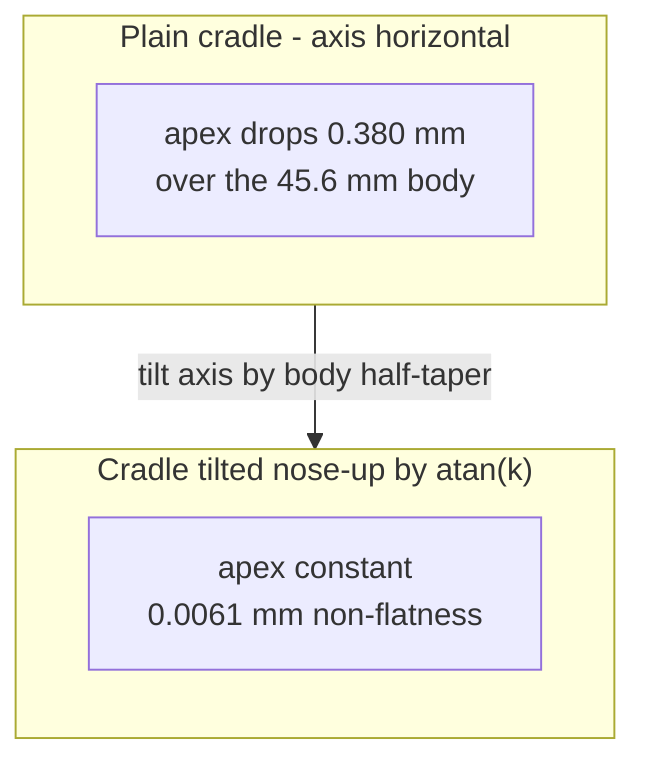

# The Levelling Tilt

The central idea of the fixture. A .30-06 case body is tapered, so a cartridge
lying in a plain cradle presents a marking surface that is **not level**, which
walks the work in and out of focus along the length of the text.

## The problem



Body radius falls from 5.982 at z=3.40 to 5.602 at z=49.00.

## The derivation

Let `k` be the body half-taper slope and `a` the nose-up tilt of the axis. With
the axis height rising as `h(x) = h0 + x * tan(a)` and the radius falling as
`r(x) = r0 - k * x`, the apex line is:

```
top(x) = h(x) + r(x)
       = h0 + x*tan(a) + r0 - k*x
```

The `x` terms cancel when `tan(a) = k`, leaving `top(x) = h0 + r0`, a constant.

```openscad
// Body half-taper, and the nose-up tilt that cancels it.
body_k    = (5.982 - 5.602) / (49.00 - 3.40);   // 0.0083333 mm/mm
tilt      = atan(body_k);                       // 0.477454 deg

// Height of the levelled engraving surface above the carrier top face,
// with the cartridge settled onto the cradle.
mark_rise = 5.982 + body_k * 3.40 - clearance;  // 5.66033
```

Applied as a single rotation when the nest is placed:

```openscad
module nest_cavity() {
  translate([head_margin, 0, carrier_h])
    rotate([0, 90 - tilt, 0])
      nest_cavity_local();
}
```

## Verified result

Measured against the real mesh at its true vertex rings, not against the
transcribed profile:

| cartridge z | true r | apex height |
|---|---|---|
| 3.160 | 5.9821 | 5.6585 |
| 12.426 | 5.9062 | 5.6597 |
| 21.692 | 5.8302 | 5.6609 |
| 30.958 | 5.7542 | 5.6621 |
| 40.224 | 5.6782 | 5.6634 |
| 49.490 | 5.6022 | 5.6646 |

**Non-flatness 0.0061 mm**, against 0.380 mm untilted. Six microns is an order of
magnitude below what an FDM printer can hold and irrelevant beside the depth of
field of a CO2 lens.

## Contracts

- `tilt` **must** equal `atan(body_k)`. It is derived, never typed in. If `CART`
  changes, `body_k` changes and the tilt follows automatically - but the result
  must be re-verified.
- The head-end axis sits exactly at the carrier top face, and rises from there.
  This is load-bearing for [lift-out-invariant.md](lift-out-invariant.md).
- Resulting heights: marking surface **5.660 mm** above the carrier top face,
  **18.660 mm** above the laser bed.

## Lessons learned

The tilt is small enough (0.477 deg) to look like a rounding error in the source.
It is not; it is the whole point of the fixture. Anyone "cleaning up" the model
by zeroing it reintroduces a 0.380 mm focus walk.

## Related

- [cartridge-profile.md](cartridge-profile.md) - where `body_k` comes from
- [lift-out-invariant.md](lift-out-invariant.md) - the other half of the tilt
- [../process/laser-setup-and-batch.md](../process/laser-setup-and-batch.md)
