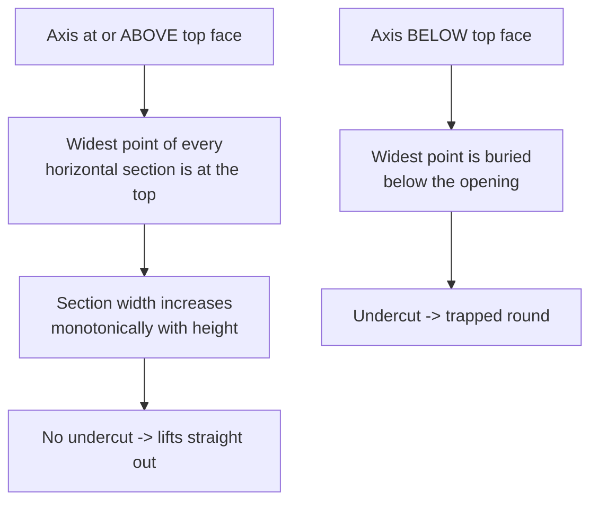

# The Lift-Out Invariant

A cartridge must lift straight up out of its cradle. This is both a usability
requirement (150 pieces get loaded and flipped by hand) and the user's original
constraint that a round nest "no more than half" into the fixture.

## The rule

> The cradle axis must sit **at or above the carrier top face at every station**.

The carrier's top face is the parting plane, and the cradle is whatever part of
the solid of revolution falls below it.



## Why it holds

The nest is placed with its axis exactly at the carrier top face at the head, and
the nose-up `tilt` only ever raises it:

```openscad
// axis height along the cartridge
h(x) = carrier_h + x * tan(tilt)     // x >= 0  =>  h(x) >= carrier_h
```

Because every cross-section of a solid of revolution is a circle centred on that
axis, and the axis never dips below the cut plane, each section's width grows
monotonically upward. No undercut anywhere.

Capture depth along the body stays deep enough to cradle the round securely:

| station | axis above top face | capture depth |
|---|---|---|
| x = 3.4 (body start) | 0.028 | 5.95 |
| x = 49 (shoulder) | 0.408 | 5.19 |

So the round is held through most of its radius, yet never past its centreline.

## Side effects worth knowing

- **Self-centring.** A circular section in a circular cradle settles to the
  bottom of the arc, so the round centres itself laterally with no adjustment.
- **Free rotation.** The round can spin about its own axis in the cradle, which
  is exactly what the 180 degree flip needs.
- **Printability for free.** The same monotonic-widening property means the
  cavity has no downward-facing surfaces, so the carrier prints with **no
  supports**, cradles facing up.

## Contracts

- Never lower the nest axis below `carrier_h`, and never add a negative tilt.
- Any feature added inside the cavity must also respect the rule. The tip channel
  and eject slot do, because both are cut downward from the axis.

## Lessons learned

The cavity is built in cartridge-local coordinates and then rotated by
`[0, 90 - tilt, 0]`. After that rotation **local +X is "down" in carrier space**,
not local Y. Getting this wrong once produced an eject slot that ran 21 mm
sideways into neighbouring nests while reaching only 5.5 mm down. The model still
rendered as a valid manifold, so it passed every automated check and was only
caught by looking at a render. Axis-mapping bugs in rotated frames are invisible
to manifold checks - render and look.

```openscad
// Local +X becomes "down" in carrier space once the nest is rotated, so the
// slot is driven along +X to break through the carrier floor.
translate([-eject_w / 2, -eject_w / 2, eject_from])
  cube([eject_w / 2 + carrier_h + 1, eject_w, eject_to - eject_from]);
```

## Related

- [levelling-tilt.md](levelling-tilt.md) - supplies the tilt this depends on
- [../fixture/carrier.md](../fixture/carrier.md)
- [../process/printing-and-machines.md](../process/printing-and-machines.md)
