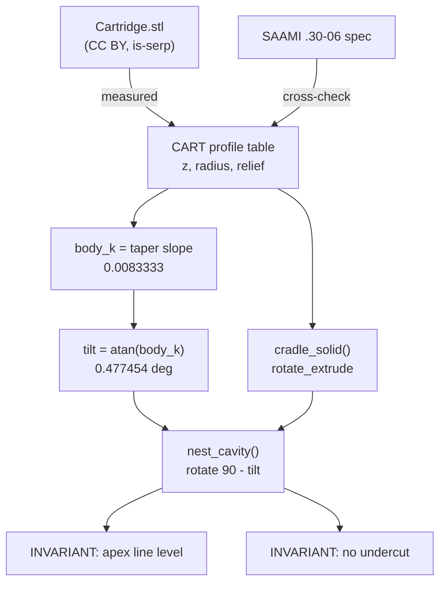

# Geometry

Everything about the shape of the cavity a cartridge sits in, and the two
invariants that make the fixture work.

## Files

- [cartridge-profile.md](cartridge-profile.md) - the `CART` table, what is
  reproduced, what is deliberately relieved, and why.
- [levelling-tilt.md](levelling-tilt.md) - the nose-up tilt that cancels the
  body taper. The central idea of the whole fixture.
- [lift-out-invariant.md](lift-out-invariant.md) - why the cradle axis must never
  sit below the carrier top face.

## The two invariants

Both are consequences of the same tilt, and both must be rechecked together if
the profile or tilt ever changes:

1. **The apex line is level.** Holds to 0.0061 mm across the case body.
2. **Nothing is captured past its own centreline.** Every round lifts straight
   out; this is also the user's original "no more than half" requirement.

## Related

- [../fixture/carrier.md](../fixture/carrier.md) - where the cavity is placed
- [../process/verification.md](../process/verification.md) - how fit is proven
