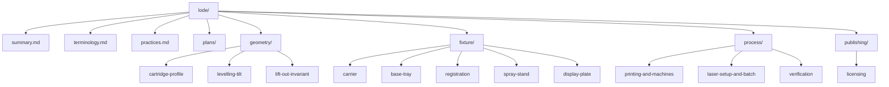

# Lode Map

Index of all lode files. Start here.

## Top level

| File | Contents |
|---|---|
| [summary.md](summary.md) | One-paragraph snapshot of the whole project |
| [terminology.md](terminology.md) | Cartridge anatomy, fixture parts, process terms |
| [practices.md](practices.md) | Patterns this project holds to |
| [plans/roadmap.md](plans/roadmap.md) | Open work and pending decisions |
| `tmp/` | Session scraps. Git-ignored. |

## geometry/ - the shape of the cavity

| File | Contents |
|---|---|
| [geometry/summary.md](geometry/summary.md) | Domain index, the two invariants |
| [geometry/cartridge-profile.md](geometry/cartridge-profile.md) | `CART` table, datum scheme, deliberate relief |
| [geometry/levelling-tilt.md](geometry/levelling-tilt.md) | The nose-up tilt that cancels body taper |
| [geometry/lift-out-invariant.md](geometry/lift-out-invariant.md) | Why the axis never drops below the top face |

## fixture/ - the physical parts

| File | Contents |
|---|---|
| [fixture/summary.md](fixture/summary.md) | Domain index, part sizes |
| [fixture/carrier.md](fixture/carrier.md) | Nest block: features, markings, invariants |
| [fixture/base-tray.md](fixture/base-tray.md) | Tray: pockets, keying, flange engraving |
| [fixture/registration.md](fixture/registration.md) | Fiducials, the measure-don't-assume doctrine |
| [fixture/spray-stand.md](fixture/spray-stand.md) | Nose-down shoulder-seat stand for clear-coating marked rounds |
| [fixture/display-plate.md](fixture/display-plate.md) | Scalloped base plate; head-to-tail base row of cases that self-stacks |

## process/ - model to marked cartridges

| File | Contents |
|---|---|
| [process/summary.md](process/summary.md) | Domain index, the pipeline |
| [process/printing-and-machines.md](process/printing-and-machines.md) | Machine budgets, print settings, STL export |
| [process/laser-setup-and-batch.md](process/laser-setup-and-batch.md) | P2 setup, batch workflow, safety |
| [process/verification.md](process/verification.md) | `verify.scad` contract, first-article check |

## publishing/ - licence and distribution

| File | Contents |
|---|---|
| [publishing/summary.md](publishing/summary.md) | Where it lives, repo layout |
| [publishing/licensing.md](publishing/licensing.md) | Two licences, attribution obligations, dedication |

## Reading order for a fresh session

1. [summary.md](summary.md) and [terminology.md](terminology.md)
2. [geometry/levelling-tilt.md](geometry/levelling-tilt.md) - the one idea
   everything else serves
3. [fixture/registration.md](fixture/registration.md) - the one number setup
   depends on
4. [plans/roadmap.md](plans/roadmap.md) - what is open
