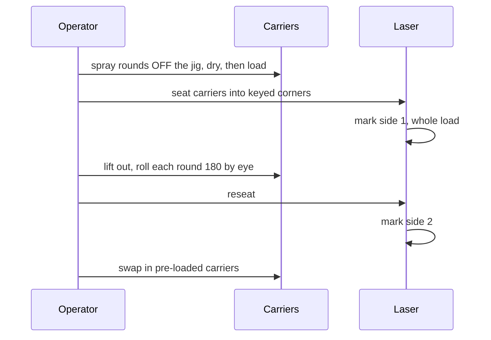

# Laser Setup and Batch Running

## Setup, once

1. **Square the base** to the gantry on its long straight edge - the flange is
   engraved `SQUARE THIS EDGE`. Tape through the flange, outside the walls.
2. **Derive the real nest pitch** from the engraved ticks. This is the single
   most important step; see
   [../fixture/registration.md](../fixture/registration.md) and remember the
   span is across **6** gaps, not 7.
3. **Set focus from the marking surface**, nominally **18.660 mm** above the bed.
   Verify with calipers - an over-extruded cradle holds rounds slightly high,
   which is a fixed offset to measure, not a defect to fix.
4. **Centre the text** on the heavy engraved line, 36 mm from the carrier's
   head-end face. Usable window is 6-46 mm from the case head.

## Running a batch

- **Spray off the jig.** Spraying loaded carriers coats the carriers, which then
  mark too. Rounds get sprayed on a rack and dried before loading.
- **Seat every round back against the head stop** and every carrier into its key
  corner.
- **Flip by eye** - roll until the first marking faces down. Accurate to a few
  degrees, which is invisible on a round cartridge.
- **Swap carriers** rather than unloading in place: load one set while another is
  under the laser. This is why several carriers are printed.

## Throughput

| Config | Per load | Loads for 150 |
|---|---|---|
| 14-up | 14 | ~11 per side |
| 28-up | 28 | ~6 per side |

## Safety

**Mark fired brass or inert dummy rounds only.** Live ammunition does not belong
under a laser; primers and propellant do not care that the beam is only meant to
reach the case wall. This is recorded in the repo README as well.

## Related

- [../fixture/registration.md](../fixture/registration.md)
- [verification.md](verification.md)
