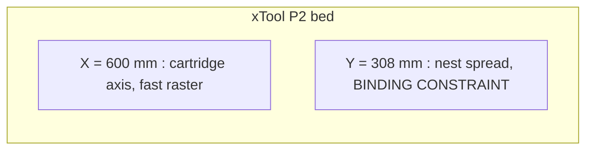

# Printing and Machines

## Target machines

| Machine | Envelope | Notes |
|---|---|---|
| xTool P2 / P2S | 600 x 308 mm bed, CO2 | The marking machine |
| Prusa XL | 360 x 360 x 360 | The printer |

**Orientation on the laser matters.** Cartridges lie along the P2's **600 mm
axis**, so text rasters along the fast axis; nests spread across the **308 mm**
axis. That makes 308 mm the binding constraint on how many nests fit, which is
why the base is long in the nest direction and short in the cartridge direction.



Both bases fit both machines:

| Part | Size | vs XL 360x360 | vs P2 600x308 |
|---|---|---|---|
| carrier | 104 x 126 | fits | - |
| base-14up | 130.8 x 285.6 | fits | fits (285.6 < 308) |
| base-28up | 241.6 x 285.6 | fits | fits |

The 285.6 mm dimension is the tight one, with ~22 mm of margin on the P2. Raising
`nest_count` or `pockets_y` eats that margin; check it before changing either.

## Print settings

- PLA. Nothing here gets hot. PETG if scorching is a concern.
- 0.2 mm layers, 3 perimeters, 15-20% gyroid infill.
- **No supports** - the model is overhang-free by construction, see
  [../geometry/lift-out-invariant.md](../geometry/lift-out-invariant.md).
- Carriers print flat, cradles facing up.
- **Brim on the base.** Large thin plate, must sit dead flat.

## Regenerating STLs

```bash
openscad --export-format=binstl -D 'part="carrier"' \
  -o stl/carrier-7nest.stl bullet-jig.scad
openscad --export-format=binstl -D 'part="base"' \
  -o stl/base-14up.stl bullet-jig.scad
openscad --export-format=binstl -D 'part="base"' -D 'pockets_x=2' \
  -o stl/base-28up.stl bullet-jig.scad
```

`part` accepts `carrier`, `base`, `both`, `demo` (shows cartridges in place) and
`none`.

**Always pass `--export-format=binstl`.** OpenSCAD defaults to ASCII STL, which
is ~3.5x larger for identical geometry (2.5 MB vs 730 KB here).

Echoed dimensions on every render act as a cheap regression check:

```
carrier  104 x 126 x 10
base     130.8 x 285.6 x 8
tilt     0.477454 deg
mark surface above laser bed   18.6603
```

## Reprint economics

`clearance` and `pocket_clr` problems are **carrier-only reprints**. The base is
unaffected by either, so a fit failure never costs the long print. Worth
remembering when deciding what to print first.

## Related

- [verification.md](verification.md)
- [../fixture/summary.md](../fixture/summary.md)
