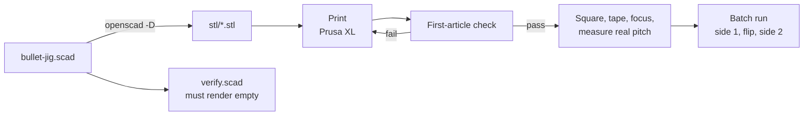

# Process

Getting from the model to marked cartridges.

## Files

- [printing-and-machines.md](printing-and-machines.md) - machine budgets, print
  settings, regenerating STLs
- [laser-setup-and-batch.md](laser-setup-and-batch.md) - setting up the P2 and
  running a batch
- [verification.md](verification.md) - the automated fit test and the
  first-article check

## Related

- [../fixture/registration.md](../fixture/registration.md)
