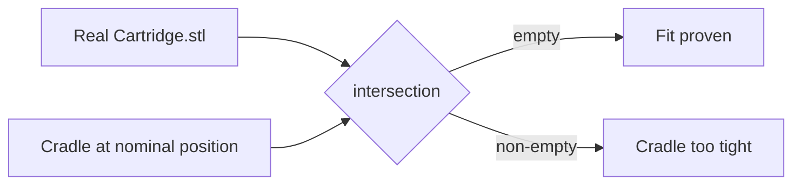

# Verification

Two layers: an automated geometric test, and a first-article check on the printed
parts. They catch different classes of failure.

## Automated: verify.scad

`verify.scad` intersects the **real `Cartridge.stl` mesh** - not the transcribed
`CART` profile - against the cradle at its nominal, un-settled position. With
`clearance` of gap everywhere, the intersection must be empty.

```bash
openscad -o /tmp/v.stl verify.scad
# expect: "Current top level object is empty."
```

**Contract: any non-empty result means the cradle is transcribed too tight
somewhere.** Run this after touching `CART`, `clearance`, `tilt`, or any nest
geometry.



## What automated checks do NOT catch

A manifold render proves nothing about correctness. An eject slot that ran
sideways into neighbouring nests rendered as a perfectly valid manifold solid.
**Render an image and look at it** after any change to placement or orientation.

## First article, on the printed parts

Full procedure lives in `docs/acceptance-check.md` in the repo (it is operator
documentation, so it ships with the model rather than living only here). Six
checks, ordered so cheap ones gate expensive ones:

1. **Base flat?** On glass. If it rocks, stop - everything below is referenced
   off this plane.
2. **Carrier drops into the pocket?** 0.4 mm/side. Binding = shrinkage on the
   126 mm axis; raise `pocket_clr`, reprint carrier only.
3. **Cartridge seats against the head stop?** 0.35 mm radial. Binding = go to
   `clearance = 0.50`, reprint carrier only.
4. **Tick span.** Nominal 96.000 mm across 6 gaps. Divide by 6.
5. **Seated apex height 18.660 mm**, measured at **both ends** of the window.
   Two equal readings prove the tilt survived the print; a difference means the
   carrier is not flat, so return to step 1.
6. **Eject slot** clears - push a round up from under the base window.

If 1-3 pass, everything remaining is setup rather than geometry.

## Verified results held

| Claim | Value | How verified |
|---|---|---|
| Apex non-flatness | 0.0061 mm | real mesh, at true vertex rings |
| Cradle fit | no interference | `verify.scad` empty |
| Part sizes | 104x126x10, 130.8x285.6x8, 241.6x285.6x8 | STL bounding boxes |
| Manifold | all parts | OpenSCAD "Simple: yes" |

## Related

- [../geometry/levelling-tilt.md](../geometry/levelling-tilt.md)
- [../fixture/registration.md](../fixture/registration.md)
