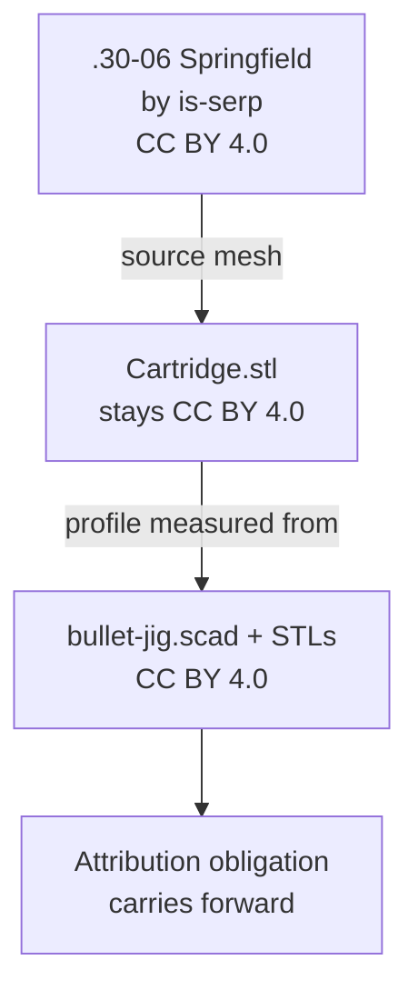

# Licensing and Attribution



## Two licences, one repo

| Covers | Licence |
|---|---|
| `bullet-jig.scad`, `verify.scad`, `stl/`, `docs/` | CC BY 4.0 |
| `Cartridge.stl` | CC BY 4.0, (c) is-serp |

`LICENSE` holds the canonical CC BY 4.0 legal text, fetched from
`creativecommons.org/licenses/by/4.0/legalcode.txt` rather than retyped.

## The upstream attribution

The cartridge profile was measured from a third-party mesh:

> **".30-06 Springfield"** by **is-serp**
> https://www.printables.com/model/101907-30-06-springfield
> Licensed CC BY 4.0 International

Recorded in three places, all of which must stay in sync: the README Credits
section, the README licence table, and the `bullet-jig.scad` header.

## Contracts

- **`Cartridge.stl` cannot be relicensed.** If the project licence ever changes,
  the mesh stays CC BY 4.0 and the attribution stays. The README licence table
  says so explicitly.
- Any remix must carry the is-serp credit forward - CC BY requires it.
- The Printables listing's licence field must match `LICENSE`.

## Dedication

The fixture is dedicated to **Allen Akin**, who died 8 September 2026; it was
built to mark cartridges for his funeral, his name on one side and *Spirit in
the Sky* on the other. The dedication appears in the README, the
`bullet-jig.scad` header, and engraved into two flanges of the base.

It is **parameterised, not hardcoded**, so anyone reusing the jig can substitute
their own words or blank it:

```openscad
dedication      = "IN MEMORY OF ALLEN AKIN";   // top flange, "" omits
dedication_edge = "SPIRIT IN THE SKY";         // right flange, "" omits
```

## Lessons learned

Do not assert a licence version you have not seen. Printables' API reports only
`"abbreviation": "CC-BY"` with no version; the "4.0 International" came from the
model page itself. For legal text, fetch the canonical copy rather than
reproducing it from memory.

Printables blocks scripted page fetches (Cloudflare 403), but its GraphQL API
answers anonymously:

```bash
curl -sS 'https://api.printables.com/graphql/' \
  -H 'content-type: application/json' -H 'origin: https://www.printables.com' \
  --data '{"query":"query($id:ID!){print(id:$id){name license{name abbreviation} user{publicUsername}}}","variables":{"id":"101907"}}'
```

## Related

- [../geometry/cartridge-profile.md](../geometry/cartridge-profile.md)
- [summary.md](summary.md)
